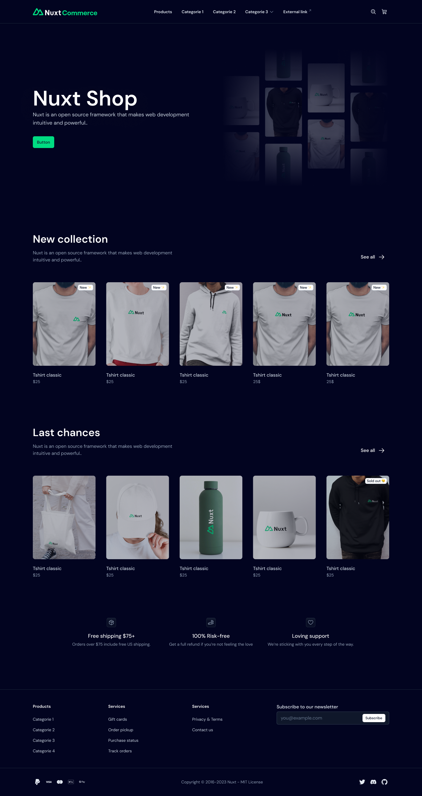

# Nuxt Commerce

Demo E-Commerce application built with [Nuxt](https://nuxt.com), [Storefront UI](https://docs.storefrontui.io/v2/) & [Shopify](https://www.shopify.com/)

Made with 💚 by [Nuxt](https://nuxt.com) & [Vue Storefront](https://vuestorefront.io/)



## Features

Nuxt Commerce comes with several useful features out of the box:

1. [Storefront UI](https://docs.storefrontui.io/v2/) - Fast, accessible, and fully customizable components built for e-commerce.
2. [GraphQL Client](https://nuxt-graphql-client.web.app/) - Minimal GraphQL Client + Code Generation
3. [Image Optimization](https://image.nuxtjs.org/) - Resize and transform your images using built-in optimizer or your favorite images CDN
4. [Fonts](https://google-fonts.nuxtjs.org/) - Deliver optimized fonts for better performance
5. [Hybrid rendering](https://nuxt.com/docs/guide/concepts/rendering#hybrid-rendering) - Set different caching rules per route using Route Rules and decide how the server should respond to a new request on a given URL
6. [Security](https://nuxt-security.vercel.app/) - Security Response Headers and middlewares to make your app more secure by default
7. [Performance audits](https://github.com/GoogleChrome/lighthouse-ci) - Lighthouse CI to contionously audit performance of your website
8. [Tests](https://vitest.dev/) - Test runner configured for easy usage
9. [SEO](https://github.com/harlan-zw/nuxt-simple-sitemap) - Simple configuration for both Sitemap & Robots

## Looking for more?

Building modern e-commerce websites might require you to add other functionalities that are not part of Nuxt Commerce. Below, there is a list of tools that you can use to address them:

1. [JSON LD](https://github.com/ymmooot/nuxt-jsonld)
2. [PWA](https://vite-pwa-org.netlify.app/)
3. [Delayed Hydration](https://github.com/harlan-zw/nuxt-delay-hydration)
4. [I18N](https://v8.i18n.nuxtjs.org/)

## Have more advanced use case?

Does your project need Data Orchestration, third party integrations, hosting or other e-commerce related functionalities? Check out [Vue Storefront](https://vuestorefront.io/) and the [open source Nuxt template using agnostic sdk & middleware](https://github.com/vuestorefront/storefront-nuxt3-boilerplate)

## Integrations

If you wish to add an integration with 3rd Party service like Content Management System, Search Engine, or Payment Provider, you can do so by using the regular Nuxt module approach.

Create a new folder in the `modules` directory named as your integration (i.e `storyblok`) and inside of it, and `index.ts` file.
If your integration already has a Nuxt module existing, you can import it as follows:
```ts
//modules/storyblok/index.ts

export default defineNuxtModule({
  async setup() {
    await installModule('@storyblok/nuxt')
  }
})
```

In this file, you can also add integration specific code like components, composables, pages, and more!

## Setup

Make sure to install the dependencies:

```bash
yarn
```

## Development Server

Start the development server on `http://localhost:3000`:

```bash
yarn dev
```

## Production

Build the application for production:

```bash
yarn build
```

Locally preview production build:

```bash
yarn preview
```

Check out the [deployment documentation](https://nuxt.com/docs/getting-started/deployment) for more information.

## Kudos

This project was higly inspired by the amazing work by @scottyzen to build Nuxt e-commerce template with WooCommerce -> <https://v3.woonuxt.com/>

Also, thanks to everyone who shared their feedback in the initial [RFC](https://github.com/nuxt/commerce/issues/1) 💚
